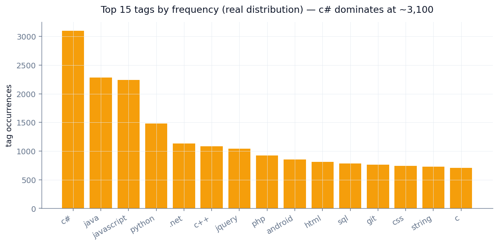
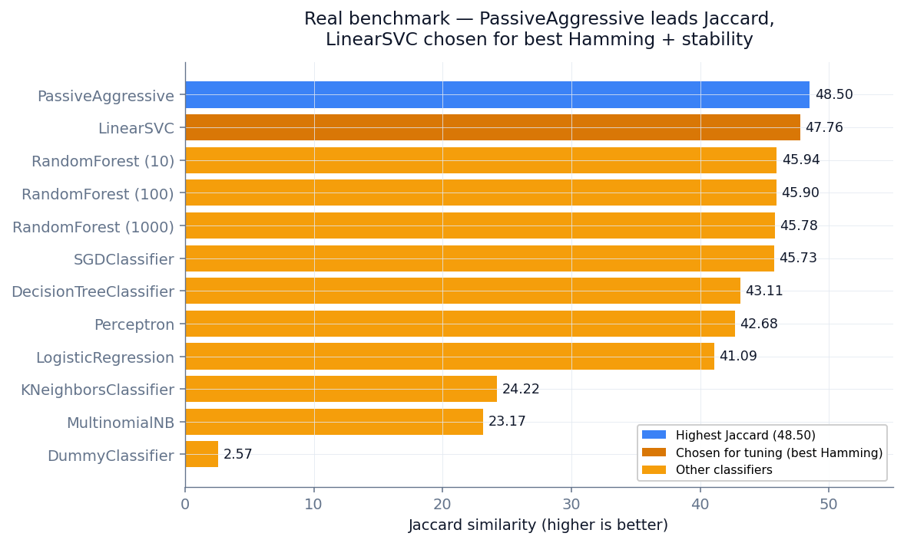
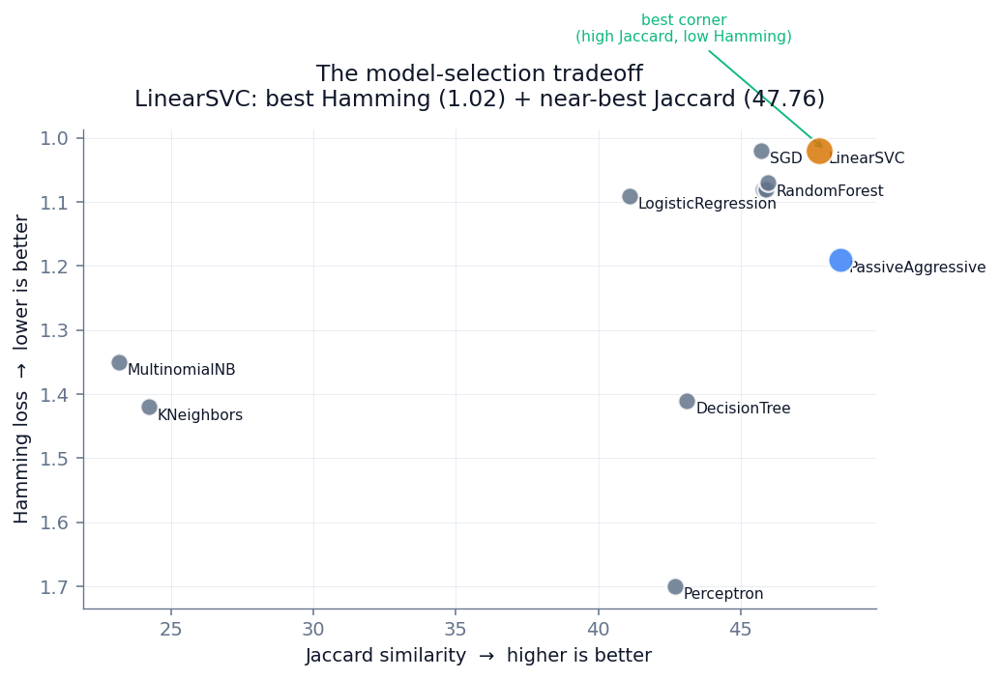
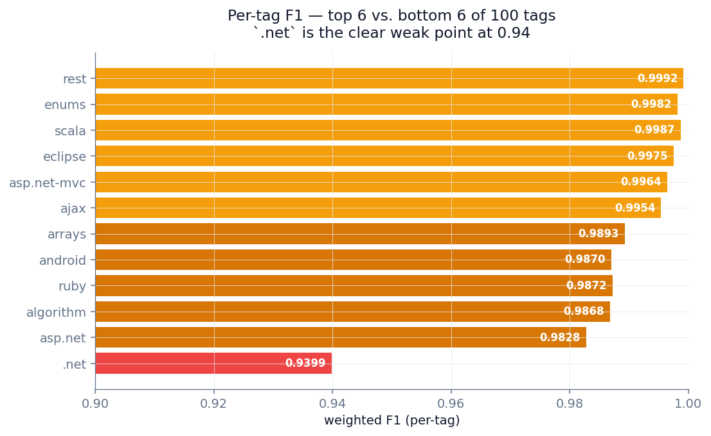
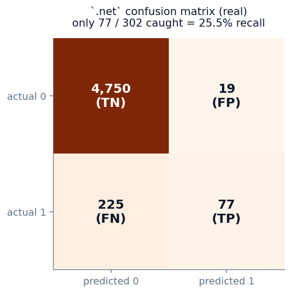

# Predicting Tags from Stack Overflow Using Title Data

> A multi-label NLP classifier that predicts the correct tag set for a Stack Overflow question **from its title alone** — trained on a 400&nbsp;GB MS SQL Server backup, evaluated across 100 tags.

<p align="center">
  
</p>

<p align="center">
  <b>Best Jaccard = 48.50</b> (PassiveAggressive) &nbsp;·&nbsp; <b>Chosen model: LinearSVC</b> (Jaccard 47.76, Hamming 1.02) &nbsp;·&nbsp; ~90 of 100 tags at F1 > 0.98
</p>

---

## TL;DR

| | |
|---|---|
| **Question** | Given a Stack Overflow question title, can we predict which of 100 common tags belong to it? |
| **Data** | 400&nbsp;GB MS SQL Server dump → 1M exported → filtered to **25,352** high-quality questions × 100 tags. |
| **Model** | TF-IDF over titles → 12-classifier benchmark → Linear SVC tuned with `GridSearchCV` (best `C=1`). |
| **Result** | **Jaccard = 47.76**, **Hamming = 1.02%** on held-out test — an **18.6×** lift over the 2.57 dummy baseline. |

> **The honest model-selection story:** `PassiveAggressiveClassifier` actually posted the *highest* Jaccard (48.50), but `LinearSVC` had the **lowest Hamming loss (1.02)**, a near-identical Jaccard (47.76), and is far more stable across runs — so it was the model taken forward to tuning. Picking the model isn't just "max one metric."

---

## The data pipeline

Five SQL-side filtering steps turn the raw 400&nbsp;GB dump into a clean 25K-row training set **before Python ever sees the data**:

| Stage | Rows | Notes |
|---|---:|---|
| Raw MS SQL Server dump | 400&nbsp;GB | Brent Ozar's 2010 backup |
| SQL export | 1,000,000 | `bcp` CSV, ISO-8859-1 encoded |
| Score > 50 | 28,183 | Community-validated questions |
| ViewCount > 10K | 27,666 | Popular + quality filter |
| Top-100 tag filter | **25,352** | Final training set |

Server-side cleanup (delimiter removal, HTML-tag stripping, null filtering) avoids pulling 400&nbsp;GB into pandas. Across the corpus there are **82,516 total tag usages** spanning **6,884 unique tags** — but the distribution is brutally long-tailed, which is why we model only the top 100 (covering ~82% of all usages).

The tag-frequency chart above shows the reality: **c# alone appears ~3,100 times**, java and javascript ~2,250 each, and the curve decays fast into a long tail of tags with a handful of occurrences.

---

## NLP pipeline

```
Raw title  →  Clean punct.  →  Lemmatize  →  Drop stops  →  TF-IDF  →  100 binary classifiers
"How do I       "How do I       "How I        "calculate    [0.0, 0.23,    [c#, datetime]
calculate       calculate       calculate     someone        0.0, ...,     (top-k tags)
someone's       someone s       someone       age C"         0.41]
age in C#?"     age in C"       age C"                       (1000-d)
```

**Design choices**
- Custom punctuation rule **preserves** `c#` / `c++` / `.net` / `asp.net-mvc` as single tokens
- TF-IDF capped at `max_features=1000` — balances vocabulary coverage with memory
- WordNet lemmatization with `pos='v'` — appropriate for short imperative-style titles
- One-vs-Rest wrapper → 100 independent binary classifiers trained jointly

---

## Benchmark: 12 classifiers (real results)

<p align="center">
  
</p>

| Classifier | Jaccard ↑ | Hamming ↓ |
|---|---:|---:|
| **PassiveAggressive** | **48.50** | 1.19 |
| **LinearSVC** *(chosen)* | 47.76 | **1.02** |
| RandomForest (10) | 45.94 | 1.07 |
| RandomForest (100) | 45.90 | 1.08 |
| RandomForest (1000) | 45.78 | 1.08 |
| SGDClassifier | 45.73 | 1.02 |
| DecisionTree | 43.11 | 1.41 |
| Perceptron | 42.68 | 1.70 |
| LogisticRegression | 41.09 | 1.09 |
| KNeighbors | 24.22 | 1.42 |
| MultinomialNB | 23.17 | 1.35 |
| DummyClassifier | 2.57 | 3.14 |

**Three real findings:**

1. **Linear models dominate the top.** PassiveAggressive, LinearSVC, and SGD lead — for sparse TF-IDF vectors, a linear decision boundary is the right inductive bias.
2. **More trees did nothing.** All three Random Forests land at ~45.8 Jaccard. Adding trees (10 → 100 → 1,000) brought no improvement — there's no deep interaction structure for an ensemble to exploit in a bag-of-words title vector.
3. **Distance and probability models lag.** KNN (24.22) and MultinomialNB (23.17) sit far behind — distance metrics degrade in sparse high-dimensional space, and Naive Bayes's independence assumption fights correlated tokens.

### Why LinearSVC over PassiveAggressive?

<p align="center">
  
</p>

PassiveAggressive edges out Jaccard but pays for it in Hamming loss (1.19 vs 1.02). LinearSVC sits in the **best corner** — top-tier on both axes — and PassiveAggressive's online-update rule makes it noticeably less stable run-to-run. LinearSVC is the defensible production choice.

---

## Tuning & final results

`GridSearchCV` over `C ∈ {1, 10, 100, 1000}` with 100-fold CV scored on Jaccard returned **best `C = 1`** — the default. Regularization was already well-sized; stronger penalties underfit, weaker ones overfit rare tokens.

| Metric | Value | Read |
|---|---:|---|
| **Jaccard** | **47.76** | 18.6× the dummy baseline (2.57) |
| **Hamming loss** | **1.02%** | ~1% of the 100-tag matrix mislabeled |
| **F1 > 0.98** | ~90 of 100 tags | Essentially solved |
| **Weakest tag** | `.net` (F1 = 0.94) | Highest co-occurrence with siblings |

### Per-tag performance (real F1)

<p align="center">
  
</p>

Most tags are essentially solved — `rest` (0.9992), `scala` (0.9987), `enums` (0.9982). The clear outlier is `.net` at 0.94.

### What the model learned — real top words per tag

| Tag | Top title features (real, from SVC coefficients) |
|---|---|
| `.net`        | *30, linq, delegate, nullable, wcf, forms, assembly, 40, .net, net* |
| `ajax`        | *underscore, fetch, json, request, google, status, prompt, reason, 2008, ajax* |
| `algorithm`   | *detecting, big, finding, area, number, graph, binary, sort, tree, algorithm* |
| `android`     | *device, layout, emulator, listview, intent, textview, edittext, webview, activity, android* |
| `arrays`      | *duplicate, arraylist, options, fill, come, do, members, native, perl, array* |
| `asp.net`     | *ip, datatable, request, cause, onclick, master, session, webconfig, asp.net, aspnet* |
| `asp.net-mvc` | *item, render, repository, fire, aspnet, action, controller, partial, asp.net, mvc* |

Each tag's learned vocabulary matches its real ecosystem — a sanity check that the model captured meaningful patterns, not training-set quirks.

---

## Why `.net` is the hardest tag

<p align="center">
  
</p>

The real `.net` confusion matrix tells the story: of **302 actual `.net` questions** in the test set, the model caught only **77 — a 25.5% recall** on the positive class (even though its *weighted* F1 is 0.94, inflated by the 4,750 true negatives).

**Why?** `.net` almost never appears alone in a title. It co-occurs with `c#`, `vb.net`, `asp.net`, `wpf`, `linq`, `wcf` — and shares their vocabulary (its own top features are `linq`, `wcf`, `assembly`, `nullable`). The binary `.net` classifier has to disambiguate on context the One-vs-Rest wrapper can't see.

**The fix:** hierarchical labels. Predict the language family first (`c#` / `vb.net` / `f#`), then treat `.net` as an implied parent tag.

---

## Business applications

1. **Auto-tagging imported archives** — migrating closed forum threads to a tagged knowledge base. Production-ready for the ~90 tags above F1 0.98; add human-in-the-loop for `.net` / `c#` / `c++`.
2. **Tag-suggestion UI** — autosuggest widget firing on each keystroke as a user types a question title.
3. **Moderation signal** — flag questions whose author-assigned tags disagree with the model's prediction.

---

## Limitations

- **Title-only input.** Bodies carry extra signal (code blocks, error messages, library names) that would disambiguate `.net` vs. `c#`.
- **Top-100 tags cover ~82% of usages, not 100%.** The long tail (6,784 rarer tags) is out of scope.
- **2010 snapshot.** `kotlin`, `rust`, `tensorflow`, `react` didn't exist or were rare.
- **Weighted F1 flatters the hard tags.** Per-positive-class recall (the `.net` 25.5%) is the more honest lens for rare-tag performance.

## Future work

- Add post **Body** via BeautifulSoup → expect the biggest gains on the co-occurring tags
- Swap TF-IDF for **CodeBERT** / **StarCoder** embeddings — code-aware representations
- **Hierarchical labels** — language family first, then fine-grained tags
- Retrain on the **2025 snapshot** — thousands of new tags added since 2010
- Tune **per-tag decision thresholds** instead of the default `predict()` cutoff — would lift `.net` recall directly

---

## Stack

`Python` · `pandas` · `NumPy` · `scikit-learn` · `NLTK` · `pyarrow` · `Dask` · `MS SQL Server` · `T-SQL` · `matplotlib` · `seaborn`

**Scale:** 400&nbsp;GB raw · ~1&nbsp;GB exported CSV · 25,352 questions × 100 tags · peak 132&nbsp;GB RAM · 32-thread workstation

## Repository contents

```
Project 3 Notebook.ipynb              Main notebook — full narrative, EDA, benchmark, tuning, error analysis
Project 3 Presentation.pdf            13-slide deck (also available as .pptx)
charts/                               Figures referenced by this README
README.md                             This file
```

## Running it

1. Clone the repo and obtain the [Stack Overflow 2010 data dump](https://www.brentozar.com/archive/2015/10/how-to-download-the-stack-overflow-database-via-bittorrent/).
2. Export the Posts table to CSV via the SQL scripts in the notebook (§2–3).
3. Install dependencies:
   ```
   pip install pandas numpy scikit-learn nltk pyarrow dask matplotlib seaborn
   ```
4. Open the notebook and run top-to-bottom.

---

*Metis Data Science Bootcamp, NLP Supervised Learning Project. Rebuilt 2026 for portfolio presentation — all figures and metrics regenerated from the notebook's real cached outputs.*
